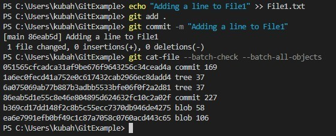
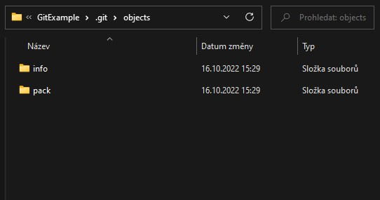

## Git Garbage Collection

The garbage collection command `git gc` essentially allows for efficient storage, saving much needed memory in repositories of any size. It is automatically triggered when using some commands, mainly when working with remote repositories, such as `git pull`. The optimization of space is important for various reasons, for example due to there being limited space that can be utilized by GitHub users, or on local machines for the purpose of saving disk space when working with large repositories. The two most important functions of Git garbage collection are reducing file size of objects that we want to keep and discarding loose objects that have no references to your repository, e.g. orphaned commits. This section is dedicated to the former, while section **git-prune.md** to the latter.

With each change that is commited, Git tracks the underlying information about the files and the changes to them in the **.git/objects** folder. However, when a change to a file is first commited, instead of tracking only the change, Git makes a new, updated copy of the previous object. If the change commited is of small scale, this results in two nearly similar objects being kept in the **.git/objects** folder, which is quite inefficient in terms of disk space management. To understand the process deeply, a demonstration run follows.

## Showcase run

1. Let's start with an empty local repository. We create **File1.txt** that only has one line, commit the change and perform `git cat-file --batch-check --batch-all-objects` to see the hash, type and size of all objects in our repository.

  

2. In the **.git/objects** folder, we can see the three folders that represent the newly created objects by the first two symbols of their respective hashes.

  

3. Now, let's perform a slight change to File1.txt and commit it. We added a single line and then ran `git cat-file --batch-check --batch-all-objects` again.

  

As can be seen, we now have 6 objects, the new blob is naturally nearly twice as large, the ineffective thing is that we also still keep the previous blob in full!

4. The **.git/objects** folder looks accordingly, the *info* and *pack* subfolders remain empty.

  

  

5. This is where `git gc` comes in handy, we usually do not want to keep objects that contain identical parts since that costs us precious space. Furthermore, there are many options to specify how the `git gc` command should be run:
- `--aggressive` takes a longer time, but performs a deeper optimization
- `--auto` uses heuristics to determine whether garbage collection should be performed at all, if not, it exits.
- `--force` triggers `git gc` even if there might be one already in progress in the current repository (mostly used for remote repositories).
- `--quiet` will hide all progress reports
- `--no-prune` will not prune any loose objects, on the same note, `--prune=<date>` will only prune loose objects older than *<date>*. A special section is dedicated to the `git prune` command, exploring it into more detail.

To show the most saved space possible, we use `git gc --aggressive`:

  

6. Now that the command has been performed, we can view the immediate effects:

*The state of the **.git/objects** folder has changed*

  

*new files have been created in the pack subfolder*

  

The best metaphor for the above process is "zipping" the objects into the pack file by compressing them all together. We can view the contents of the new **pack** file to see the whole extent of the operation, to do so we can use the command `git verify-pack -v` and add the path to the file.

  

As opposed to the state prior to using `git gc`, we now have only have fully stored the latest *blob*, while its predecessor only contains the difference between them with reference to the new version at the end of the line.

## Measuring effects

In our case, the two *blobs* added together make up 110 bytes, while previously they amounted to 164 bytes, we managed to save 33% of disk space by executing `git gc`! The real, non-negligible effect is most relevant when working with large files since their near identical copies make up much more space.

